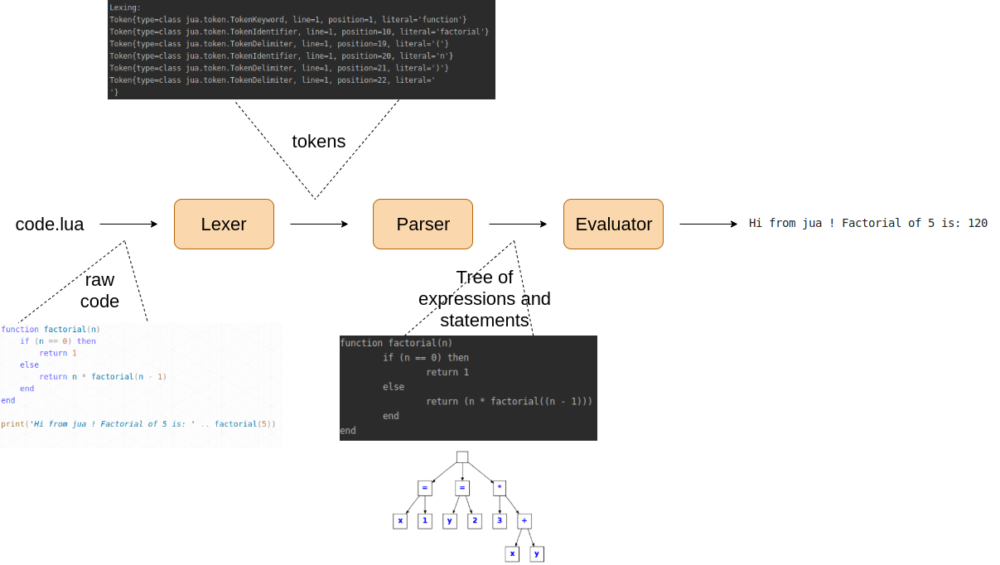
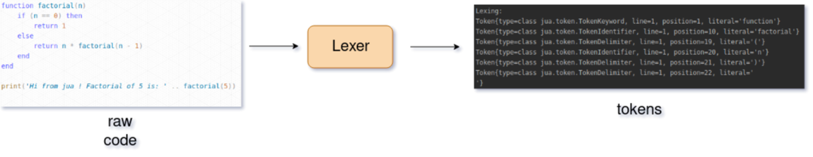
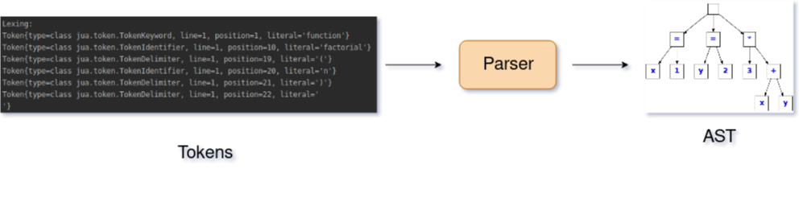
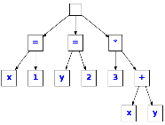

# jua

Jua is a lua interpreter implemented in java.

It features a CLI (repl + interpreter for files) and a web application.

You can access the web application [here](http://jua.herokuapp.com)  (disclaimer it won't work in https because it's using heroku's free tier).

## Installation

### Requirements:

- Java 11 or later
- Gradle 5 or later

OR

- [docker](#Docker)

[**SDKMAN!**](https://sdkman.io/) is a good solution to install and manage Gradle, Java SDK, etc...

### Setup

Clone the project:

```bash
git clone git@github.com:jua-cs/jua.git
```

## Usage

To build jua you can run:

`./gradlew assemble`

This will build a jar in `./build/libs/jua-0.0.0.jar`

that you can run doing:

`java -jar ./build/libs/jua-0.0.0.jar --help` (this will prompt you the help of the Jua CLI)

### REPL

To launch a lua REPL you can just do: `java -jar build/libs/jua-0.0.0.jar`

It will prompt you with a REPL where you can write lua code and it will be lexed, parsed and evaluated on the fly.

### File execution

To execute a specific file you can do: `java -jar build/libs/jua-0.0.0.jar <my_file.lua>`, for instance: `java -jar build/libs/jua-0.0.0.jar ./src/test/java/jua/evaluator/testdata/bool.lua`

This will execute the given lua file directly and exit shortly after.

### Execution API

To launch the web server only you can do: `java -jar build/libs/jua-0.0.0.jar --server`, this will start it on port `3000` by default (you can configure it using the `PORT` env variable).

You can then try it with: `curl -XPOST -H 'Content-Type: application/json' -d '{"code": "print(100 * 5)"}' http://localhost:3000/api/v1/interpreter`.

If you have [yarn](https://yarnpkg.com/lang/en/) and [nodejs](https://nodejs.org/en/) installed you can also run the web UI (or access it [here](http://jua.herokuapp.com)) to access this API by execution the `start-front-dev` script located in the `scripts` directory.

### Debug

There is also a `-d`, `--debug` flag that allows you to log what's happening during the different steps (lexing, parsing and evaluation)

## Tooling

To setup the pre-commit hooks (checks for linting of both the backend and the frontend) you can run:

`./gradlew installGitHooks`

You can also use the scripts in `./scripts`

- `start-front-dev` starts the frontend in development mode

### Docker

You can also run the whole stack using [docker](https://www.docker.com/) or [podman](https://podman.io/):

`docker build . -t jua && docker run -p 127.0.0.1:3000:3000 jua`

Then just launch your favorite browser and head to `http://localhost:3000/` to execute some *lua*.

## Architecture

Let's describe the architecture of the project. We'll start by the first parts which have been built. It explains how a given string, representing some *lua* code, is processed and interpreted.



There is also a class diagram available [here](./docs/jua_classes.png).

### Lexer

[`/src/main/java/jua/lexer`](./src/main/java/jua/lexer)





The job of the *Lexer* is to transform the input (a stream of strings) into a stream of *Tokens*.

#### Tokens

*Tokens* are the first abstraction around the text input. Basically, it separates words and punctuation, and try to give them some meaning.
We have several types of Tokens :

- **Operator**: these are all the symbols which operate on arguments: *+*, *-*, */*,etc...
- **Keyword**: Reserved names for the language like *if*, *for*, *end*, etc...
- **Separator**: Punctuation characters, delimiters like : *(*, *}*, *,*, etc...
- **Literal**: explicit number, textual, data: *3.4*, *0xff*, *"hello"*
- **Identifier**: name chosen by the programmer for a variable, function: *x*, *myFunction*
- **Special**: invalid token, end of line

The tokens for the *jua* language are defined in [src/main/java/jua/token](./src/main/java/jua/token). There is a main **abstract** class [Token](./src/main/java/jua/token/Token.java) from which all the the other tokens ([*TokenOperator*](./src/main/java/jua/token/TokenOperator.java), [*TokenKeyword*](./src/main/java/jua/token/TokenKeyword.java), etc...) inherit. The base attributes a Token has are : line, position on this line and literal, which is the explicit *string* from the code.

*Enumerations* are used to list all the explicit tokens we expect to encounter inside a given token type.

A [*TokenFactory*](./src/main/java/jua/token/TokenFactory.java), which follows the **Factory Pattern**, is used to instantiate all the Tokens.

#### How does the Lexer works ?

By looking *character by character*, the **Lexer** returns a stream of Tokens. With a simple *switch statement*, it can determinate the correct token. If we found a `(`, it returns a `TokenDelimiter("(")` .

Sometimes, for example for `*<=*`, it needs to look ahead for the next characters. Therefore, when it finds a `<`, it *peeks* the next characters, to distinguish `<<` , `<=` or just `<`.

Then, it handles others tokens like literals and identifiers.

### Parser



The job of **Parser** transforms the stream of Tokens from the **Lexer** into an **Abstract Syntax Tree** (AST).

From [Wikipedia](https://en.wikipedia.org/wiki/Abstract_syntax_tree):
> In computer science, an abstract syntax tree (AST), or just syntax tree, is a tree representation of the abstract syntactic structure of source code written in a programming language. Each node of the tree denotes a construct occurring in the source code. 

For example for a simple statement like : 

```lua
x = 1
y = 2
3 * (x + y)
```

We'll have this AST: 



The AST is composed of two types of elements : *Expressions* and *Statements*.

A *statement* is the base of the program, something to execute. A lua program is list of *statements*: variable definition of assignements, function definition or procedure execution. A statement is composed of several others statements and expressions.
An *expression* is an arithmetic combination of operator and function calls that returns a result, we parse them with the [Pratt algorithm](https://en.wikipedia.org/wiki/Recursive_descent_parser).

We have a StatementParser interface implemented for each type of statement that operates on the token stream to look up the type of the next statement and parse it.
Similarly we have expression parsers interfaces, InfixParser and PrefixParser implemented for each type of expression and used in the Pratt algorithm.

Let's take an if statement as example:
- to know if the next *statement* is an if we simply compare the next token with the keyword 'if'.
- an if statement is composed of condition *expression*, and two substatements, the consequence and the alternative, with the alternative being facultative.
When parsing an if *statement* we have to parse recursively the *expression* and the *statements*, taking care of the separators: `if expression then consequence else alternative end`.

### Evaluator

The [jua evaluator] is a tree walking evaluator, it simply visits each node of the AST and evaluate them.

This is possible because each AST node implement the [Evaluable](./src/main/java/jua/evaluator/Evaluable.java) interface.

This works for both Expressions and Statements.

An example of AST evaluations can be found [here for the multiplication](./src/main/java/jua/ast/ExpressionMultiplication.java)

### Testing

[`src/test/java/jua/{evaluator, lexer, parser}`](./src/test/java/jua/)

We have done a lot of tests trough the development of the application. Since we first developed the Lexer, then the Parser followed by the Evaluator, we wrote tests for each steps of this process which can assure that each part of the application does its jobs correctly.

After the first working version, we had to add some new features like a new *keyword* or *bitwise operators*, for which a change in the three services were necessary. In this case, all these tests permit to develop without worrying about what have been done before.

To implement more tests in a simple way, we also use a directory with some [lua scripts](./src/test/java/jua/evaluator/testdata/). A test function in `EvaluatorTest.java` compares all the `myTestFile.lua` to the corresponding expected results in `myTestFile.expected`. Add new test is therefore very easy, just write a new `script.lua` and generate the output `lua script.lua > script.expected`.
